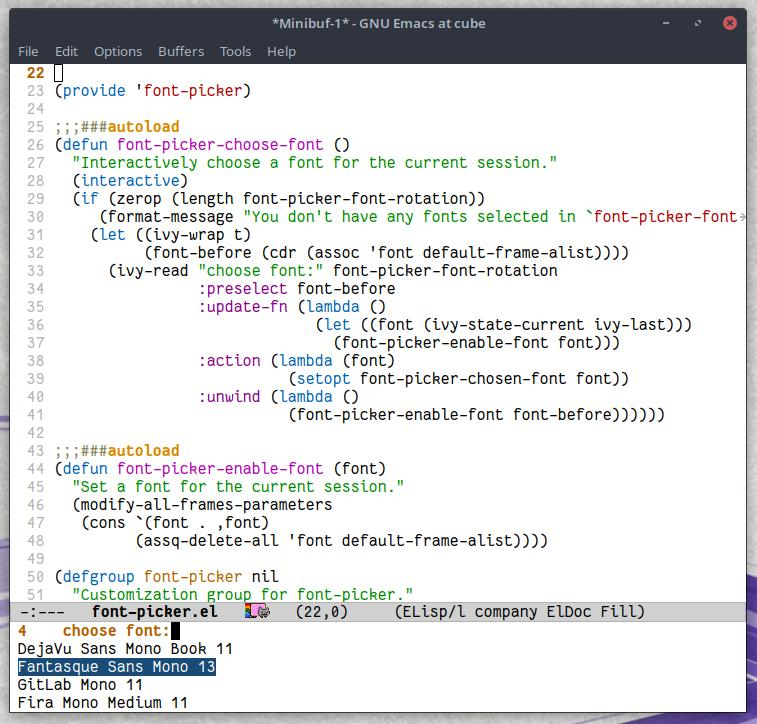

# font-picker.el

This package is for people who always switch between programming fonts a lot. It gives you an interactive font selection prompt (`font-picker-choose-font`) with the fonts selected in the `font-picker-font-rotation` variable.  That font gets set to the `font-picker-chosen-font` variable, which you can save to have the font load every time you open Emacs.
